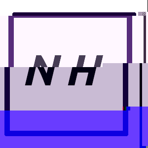

# About Me

Hello! I'm a high school senior passionate about coding and hacking, planning to major in Computer Science in the fall. 

## Programming

I've used a variety of languages and frameworks for different projects, including:

- Rust for CLI and GUI applications, as well as some libraries

- NodeJS for web servers

- MongoDB for document storage

- Some limited experience in C, C++, and Python.

- Client-side web applications using both jQuery and vanilla JavaScript.

Recently, I swapped from github to [sr.ht](https://sr.ht) for most of my major projects.

## Projects

Here's a list of the projects I've written that I feel are useful enough to others to share(though I by no means claim they are all *optimal*). 

### CLI Apps

- [eidolon](https://git.sr.ht/~nicohman/eidolon): A tool to manage and launch games on linux with minimalized bloat.

- [raven](https://git.sr.ht/~nicohman/raven): A Rust-based theme manager for linux, supporting over 15 different ways to customize your rice. It also has a reasonably in-depth wiki [here](https://man.sr.ht/~nicohman/raven).

- [usb-main](https://github.com/nicohman/usb-main): A nodejs-based CLI tool to download, update, and burn images of Linux distros automatically.

- [wyvern](https://git.sr.ht/~nicohman/wyvern): Still a WIP, this tools lets you easily download, update, sync the save files of and claim free games from [GOG.com](https://gog.com).

### Libraries

- [butlerd-rs](https://git.sr.ht/~nicohman/butlerd-rs) : A Rust library to interface with [itch.io](https://itch.io)'s [butler daemon](https://github.com/itchio/butler).

- [gogapi-rs](https://git.sr.ht/~nicohman/gogapi-rs): A Rust library for making calls to the GOG.com web API.

- [ravenlib](https://git.sr.ht/~nicohman/ravenlib): The library that powers raven, available for others to easily build their own clients.

### Excursions into the Web

- [ravenserver](https://git.sr.ht/~nicohman/ravenserver): An online server for people to share and install raven themes from. I run an instance [here](https://demenses.net). Written using NodeJS, with zero client-side JavaScript.

### Graphical Apps

- [graven](https://git.sr.ht/~nicohman/graven): A graphical interface for raven, still in alpha.

### Other

- [school-alerter](https://github.com/nicohman/school-alerter) is a nodejs daemon that scrapes my school's Trumba calender and texts me every morning with what time I have to be at school that day, depending on the class schedule that day.